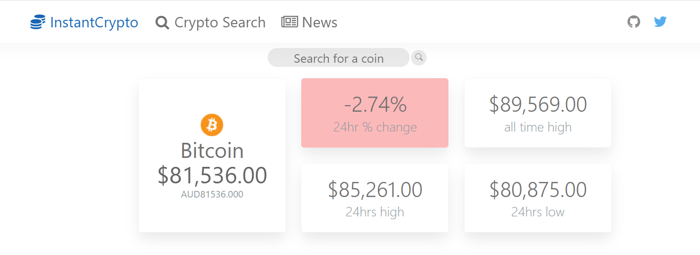
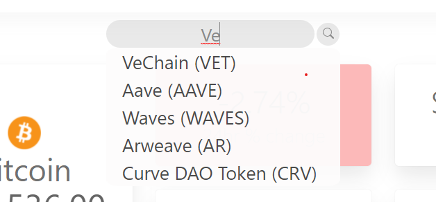
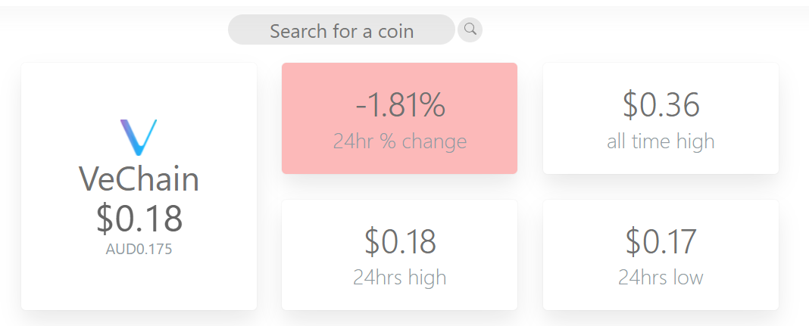
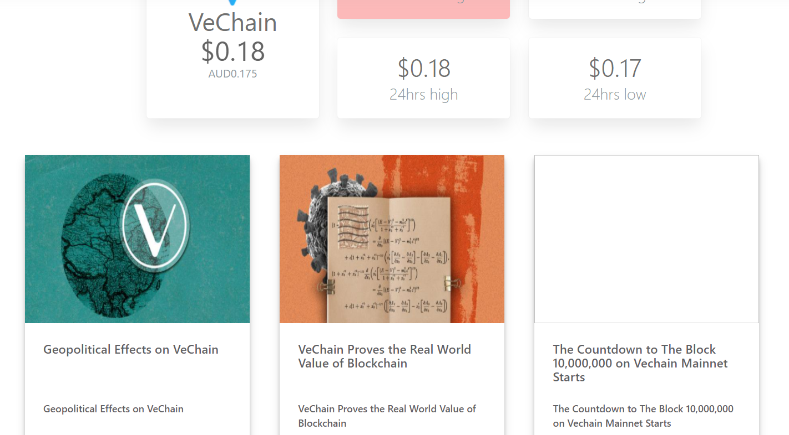
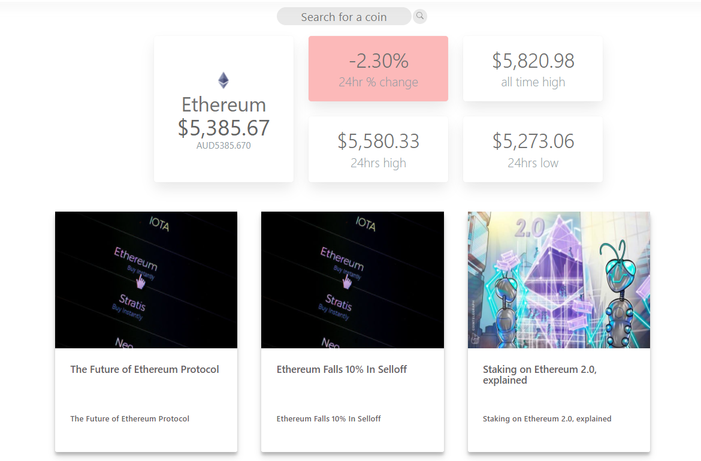
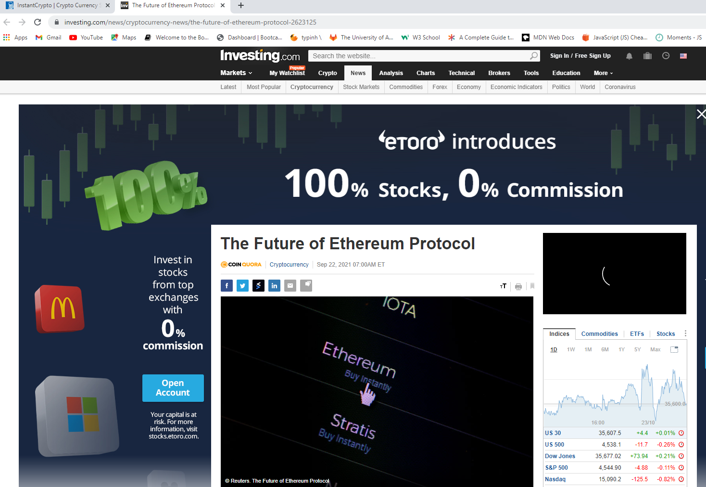

# Group Project 1 - InstantCrypto 

## Table of Contents
- [Description](#description)
- [Usage](#usage)
- [Features](#features)
- [Credits](#credits)
- [License](#license)

## Description
Working in a small group we were given the opportunity to create and develop a web-application of our choosing.

The project had to include the following: 
- Use a CSS framework other than Bootstrap 
- Be interactive (i.e accept and respond to user input)
- Use at least two Server-side API's
- Does not use alerts, confirms or prompts
- Use client-side storage to store persisent data 
- Be responsive 
- Have a polished UI 
- Be deployed to GitHub Pages 
- Have a clean repository that meets quality coding standards 
- Have a quality README 

Our motivation was to make an application that highlighted all the skills and knowledge we have learnt so far in our web-development journey. 

We decided to build our project around 2 seperate elements that logically blend well together, but in the real world do not appear to be common. We paired cryptocurrency data with recent and relevant news articles related to a specific cryptocurrency. This would allow a user to have a more streamlined experience and stay in one place, rather than checking the value of their currency and then having to open a new application to find out why the value has changed or increased. 

There were a number of problems that had to be resolved in order to successfully launch the web-application; **InstantCrypto**. 
1) Finding the correct server-side API's that would allow us to extract the neccessary data to use in our application.
2) Understanding and implementing git branching and merging while working in a team enviroment. 
3) Ensuring that all members of the project understood the desired outcome and were able to efficiently work towards the outcome. 
4) Finding a CSS framework that was not Bootstrap. 

Depsite these probems we were able to overcome them to successfully create and launch our application. In doing so we learnt many skills that will help us to further develop as web developers. A standout learning outcome was when using serve-side APIs it is important to have a firm understanding of it's documentation. This is important to understand as it highlights what is included as well with the API as well as limitations, for example; how many API calls are included and if you exceed these calls what happens. Another important lesson was how to successfully use Git branching / merging and why it is important as well as how to resolve any conflicts that can occur.

## Usage
View the deployed application at https://josephdaw.github.io/instant-crypto

*NOTE: the subscription for the News API expires on 31 Oct 2021. Unfortunately, searches after the aforementioned date will not return news data.*

The user opens up the application and is presented with a default cryptocurrency (Bitcoin) and is presented with an array of data. The data presented is; current price (presented in AUD), % price change for the past 24hours (if negative change tile will be red, if positive tile will be green), all time high price and finally the 24 hour high and low price. 

The user is then able to search any cryptocurrency using the search bar to bring up the data for the respective coin they search, such as VeChain. An autocomplete was also included in the search bar for the user's convenience.  

Once the user confirms the coin they want to search, the new data is displayed. 

Under the cryptocurrency data the user can find recent and relevant news articles related to the searched coin. 

If the user decides to search for a new coin, they enter a coin into the search bar, click on the search icon, and then will be displayed with the new coin data as well as news articles related to that coin. 

If the user refreshes the landing page, the most recent search is stored in local storage and will persist on the page. 

If the user clicks on the desired news article a new landing page window opens and they are taken to the new article. Note: InstantCrpyto landing page does not close. 

## Features
- HTML
- CSS 
- Bulma 
- Font Awesome 
- JQuery 
- Server-side API's
- Git Branching Workflow 
- Agile Software Development 

## Credits
The collaborators for this project were: 
- Stefanie Buntz - https://github.com/sbuntz 
- Joseph Daw - https://github.com/josephdaw
- Michael West - https://github.com/mjhwest
- Gurtej Thandi - https://github.com/gurtej154

Crytocurrency data was collected using:
https://www.coingecko.com/en/api

News article data was collected using: 
https://mediastack.com/

## License
This project is released under the [MIT License](LICENSE)